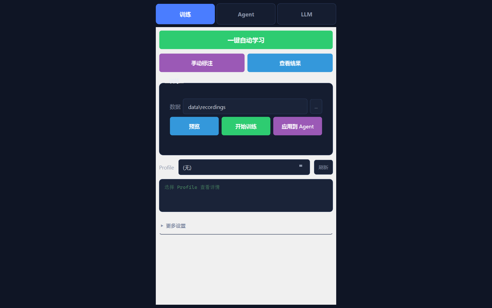
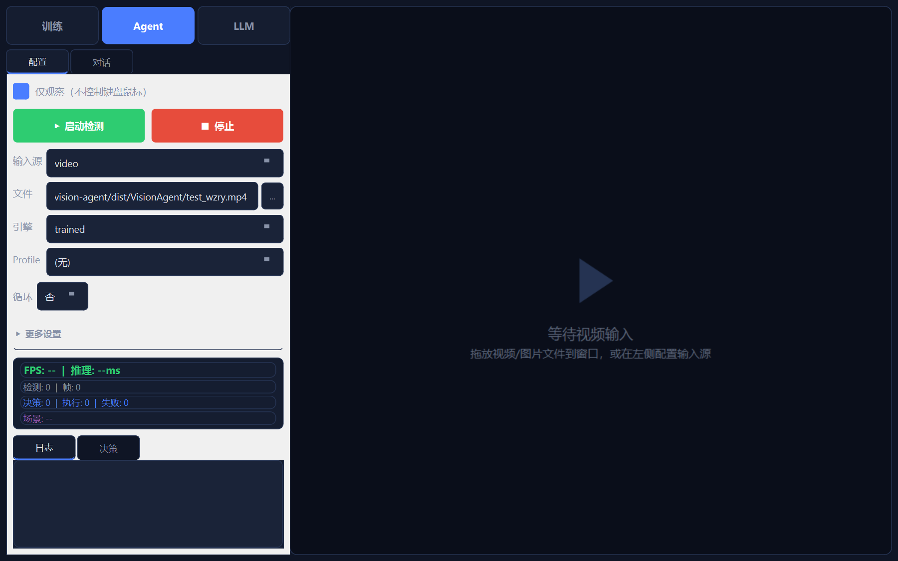
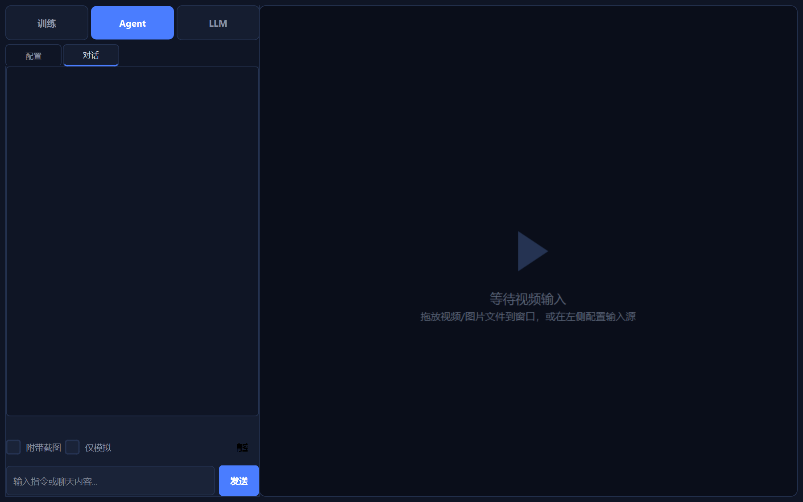
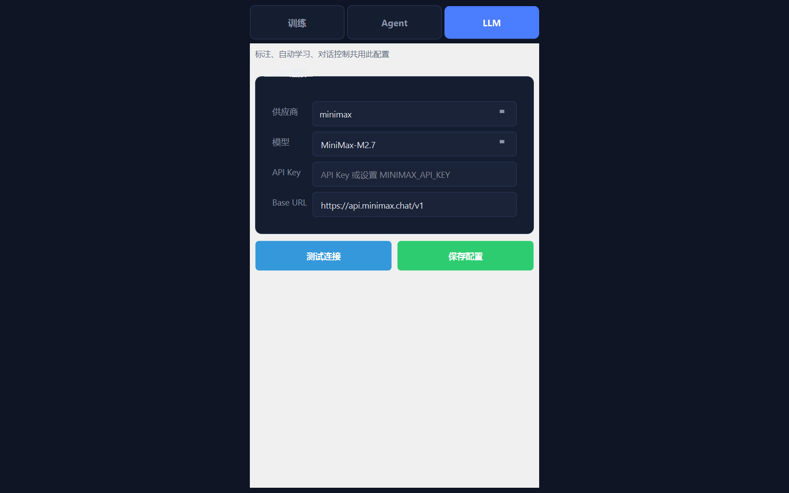

# Vision Agent

[](https://python.org)
[](LICENSE)
[](https://pytorch.org)
[](https://doc.qt.io/qtforpython/)

**Real-time visual perception + AI decision-making + automated action execution framework.**

一个基于计算机视觉的智能自动化框架。通过 YOLO 实时识别画面中的目标，结合 AI 决策引擎自动做出反应并执行操作（按键、鼠标、API 调用等）。

> **核心思路**：看到什么 → 判断该做什么 → 自动去做。整个过程可以从零开始自动学习，不需要手写规则。

---

## 界面预览

### 训练工坊

一键自动学习、手动标注、模型训练、Profile 管理，高级设置折叠隐藏。



### Agent 执行

配置输入源、决策引擎、Profile，启动检测后实时显示视频画面和检测结果。



### AI 对话控制

通过自然语言与 AI 对话，支持纯聊天和工具调用两种模式。AI 自动判断是否需要执行桌面操作。



### LLM 配置

独立的 LLM 连接配置页面，标注、自动学习、对话控制共用此配置。



---

## 能做什么

| 场景 | 说明 |
|------|------|
| **游戏 AI** | 识别游戏画面中的角色/敌人/技能，自动决策攻击、释放技能、撤退。内置王者荣耀、FPS 场景模板 |
| **桌面自动化** | 识别屏幕上的 UI 元素（按钮、输入框、图标），自动点击、输入、执行快捷键 |
| **视频/图像分析** | 对视频流或图片进行实时目标检测，统计目标数量、跟踪位置，通过 WebSocket 推送结果 |
| **自动学习闭环** | 录视频 → LLM 自动标注 → 训练决策模型 → 实时运行，全程无需手写规则 |

---

## 架构

```
感知层:  Sources(screen/camera/video/image/stream) → ModelManager → Detector → DetectionResult
         SceneClassifier(场景识别) → ROIExtractor(区域特征)
决策层:  StateManager(跨帧状态/空间/ROI) → DecisionEngine → Action
         ├─ Rule     (规则引擎，零延迟)
         ├─ Trained  (MLP/RF，毫秒级)
         ├─ LLM      (Claude/OpenAI/本地，秒级)
         ├─ Hierarchical (分层：战略→战术→操作)
         └─ RL       (DQN 强化学习，自主探索)
执行层:  ToolRegistry → Tools(keyboard/mouse/api_call/shell) → ActionAgent
协调层:  AutoPilot(场景识别→Profile路由→自动训练→热加载)
         Pipeline 串联 + WebSocket + PySide6 GUI
```

---

## 功能详细说明

### 感知与检测

- **YOLO 实时检测** — 支持 YOLOv8 全系列模型（n/s/m/l），自动选择 GPU/CPU
- **多输入源** — 屏幕捕获、摄像头、视频文件、图片目录、RTSP/HTTP-FLV/HLS 流、B站直播间号
- **ROI 特征提取** — 从固定区域提取特征（血条比例、颜色、亮度），辅助决策
- **场景自动分类** — 基于检测结果自动识别当前场景，时序平滑防抖动

### 决策引擎（5 种可切换）

| 引擎 | 延迟 | 说明 |
|------|------|------|
| **Rule** | 零延迟 | 基于 if-else 规则的决策，适合简单场景 |
| **Trained** | 毫秒级 | MLP 或 RandomForest 轻量模型，训练后使用 |
| **LLM** | 秒级 | 接入 Claude / OpenAI / Qwen / DeepSeek / MiniMax / Ollama，带可配置决策间隔 |
| **Hierarchical** | 混合 | 三层架构：战略层（5s）→ 战术层（1s）→ 操作层（每帧），各层可用不同引擎 |
| **RL** | 毫秒级 | DQN 强化学习，自主探索 + 经验回放 |

### 数据标注与训练

- **LLM 自动标注** — 视频抽帧 → YOLO 检测 → LLM 分析画面并标注动作 → JSONL 数据集
  - 支持 Tool Calling（函数调用 + enum 约束）和文本解析两种模式
  - 支持多视频批量标注，自动生成独立输出文件
- **标注可视化回放** — 逐帧回放检测框 + LLM 决策动作/理由，含动作分布统计图
- **标注纠错** — 可视化回放中直接修改动作、删除坏样本，保存修正后的 JSONL
- **标注 A/B 对比** — 加载两份标注文件，逐帧对比决策差异，统计一致率
- **决策模型训练** — 支持 MLP 和 RandomForest，实时显示 Loss / Accuracy 训练曲线
- **数据集质量分析** — 训练前分析样本数量、动作分布均衡度，提示潜在问题
- **YOLO 自定义训练** — GUI 内配置数据集和参数，一键训练检测模型
- **人工操作录制** — 录制键盘/鼠标操作 + YOLO 检测结果，生成训练数据

### AI 对话控制

- **自然语言对话** — 配置 LLM 后即可对话，AI 自动判断是否需要调用工具
- **工具调用** — 支持键盘模拟、鼠标操作等，LLM 决定何时使用
- **纯聊天模式** — 无需工具注册也可正常对话
- **思考过程过滤** — 自动剥离推理模型的 `<think>` 标签，只显示最终回复

### 自动化与集成

- **场景 Profile** — YAML 配置定义场景（动作列表、按键映射、ROI 区域），快速切换
- **AutoPilot** — 自动识别场景 → 匹配 Profile → LLM 标注 → 训练 → 热加载，全自动闭环
- **动作执行** — 键盘模拟、鼠标模拟、HTTP API 调用、Shell 命令
- **WebSocket 推送** — 实时推送检测结果和决策动作 JSON，供外部系统对接
- **配置导入/导出** — 一键导出/导入配置和 Profiles 为 ZIP 压缩包
- **EXE 打包** — 一键打包为独立可执行文件，无需 Python 环境

---

## 快速开始

### 方式一：EXE 直接运行（推荐）

从 [Releases](../../releases) 下载最新版压缩包，解压后双击 `VisionAgent.exe` 即可，无需安装 Python。

### 方式二：源码运行

```bash
# 安装依赖
pip install -r requirements.txt

# GPU 支持（可选，推荐 NVIDIA 显卡用户安装）
pip install torch torchvision --index-url https://download.pytorch.org/whl/cu121

# GUI 模式
python gui_app.py

# CLI 模式
python main.py
python main.py --source screen --model yolov8n.pt

# Windows 快速启动（自动创建 venv）
start.bat
```

### 方式三：自行打包 EXE

```bash
# 一键打包（自动创建 venv + 安装依赖 + PyInstaller 打包）
build.bat

# 产出在 dist/VisionAgent/ 目录下
dist\VisionAgent\VisionAgent.exe
```

> 打包使用 CPU 版 PyTorch，体积约 **886 MB**，运行内存约 **400 MB**。

---

## 使用场景

### 场景一：从零开始自动学习

> 最推荐的使用方式，全程无需手写规则。

1. 准备一段游戏/操作视频
2. 切换到 **LLM** 页面，配置 LLM 供应商和 API Key，点击「保存配置」
3. 切换到 **训练** 页面，点击「一键自动学习」
4. 系统自动完成：视频抽帧 → YOLO 检测 → LLM 标注 → 训练决策模型
5. 点击「查看结果」，可视化回放检测框 + 决策动作，支持纠错
6. 切换到 **Agent** 页面，引擎选 `trained`，启动检测

### 场景二：手动标注 + 训练

1. **训练** 页面 → 点击「手动标注」，选择视频和 LLM
2. 标注完成后点击「查看结果」，逐帧审核，可纠错或 A/B 对比
3. 确认标注质量后点击「开始训练」，实时查看训练曲线
4. 点击「应用到 Agent」，自动切换引擎

### 场景三：LLM 实时决策

1. **LLM** 页面配置好 LLM 连接
2. **Agent** 页面 → 引擎选 `llm`，输入源选「屏幕捕获」
3. 启动检测，LLM 每秒分析画面并决策（间隔可调）

### 场景四：AI 对话操控

1. **Agent** 页面 → 切换到「对话」Tab
2. 输入自然语言指令（如「帮我点击屏幕中间」「按下 Ctrl+S」）
3. AI 自动判断是否需要执行操作，也可以纯聊天

### 场景五：全自动 AutoPilot

1. 在 `profiles/` 目录下准备场景 YAML 配置
2. **Agent** 页面 → 展开「更多设置」→ 勾选「AutoPilot」
3. 启动检测，系统自动完成：场景识别 → Profile 匹配 → 标注 → 训练 → 热加载

---

## 界面说明

界面分为 3 个模式，通过顶部按钮切换：

| 模式 | 用途 | 核心操作 |
|------|------|----------|
| **训练** | 数据标注、模型训练、Profile 管理 | 一键自动学习、手动标注、查看结果、开始训练 |
| **Agent** | 实时检测与执行 | 配置输入源/引擎、启动检测、AI 对话 |
| **LLM** | LLM 连接配置 | 选择供应商/模型、填写 API Key、测试连接 |

常用设置直接显示，高级设置收纳在「更多设置」折叠区内。

---

## 场景 Profile

Profile 是预定义的场景配置，存放在 `profiles/` 目录下：

```yaml
name: wzry_5v5
display_name: 王者荣耀 5v5
yolo_model: runs/detect/wzry/weights/best.pt
actions: [attack, retreat, skill_1, skill_2, skill_3, ultimate, recall, idle]
action_key_map:
  attack: {type: key, key: a}
  skill_1: {type: key, key: "1"}
roi_regions:
  hp_bar: [0.42, 0.92, 0.58, 0.95]
  minimap: [0.0, 0.7, 0.2, 1.0]
scene_keywords: [hero, tower, minion, monster]
auto_train:
  enabled: true
  sample_count: 500
  llm_provider: claude
```

内置模板：

| 模板 | 文件 | 说明 |
|------|------|------|
| 王者荣耀 5v5 | `wzry_5v5.yaml` | 8 动作，含血条/小地图/技能栏 ROI |
| 通用 FPS 射击 | `fps_generic.yaml` | 12 动作，含准心/血量/弹药 ROI |
| 桌面通用 | `desktop.yaml` | 8 动作，使用预训练 yolov8n.pt |

---

## 数据管线

```
准备视频 → LLM 自动标注 → 可视化回放审核 → 纠错/A/B对比 → 训练模型 → 部署
```

### CLI 方式

```bash
# 人工录制操作数据
python main.py --record --record-dir data/recordings

# 训练决策模型
python scripts/train_decision.py --data data/recordings/*.jsonl --output runs/decision/exp1

# 使用训练模型
python main.py --decision trained --decision-model runs/decision/exp1
```

### LLM 标注输出规范化

| 模式 | 说明 | 适用场景 |
|------|------|----------|
| **Tool Calling**（默认） | 函数调用 + `enum` 约束，LLM 被强制从预设动作列表中选择 | Claude、GPT-4o、Qwen 等支持 function calling 的模型 |
| **文本解析**（回退） | 从自由文本中提取 JSON 或关键词匹配 | Ollama 本地模型等不支持 tool calling 的场景 |

---

## WebSocket API

连接 `ws://localhost:8765` 接收实时数据。

**检测结果：**
```json
{
  "type": "detection",
  "frame_id": 42,
  "timestamp": 1710000000.123,
  "inference_ms": 12.5,
  "frame_size": [1920, 1080],
  "count": 2,
  "detections": [
    {
      "class_id": 0,
      "class_name": "person",
      "confidence": 0.92,
      "bbox": [100.0, 200.0, 300.0, 500.0]
    }
  ]
}
```

**决策动作：**
```json
{
  "type": "decision",
  "actions": [
    {
      "tool": "keyboard",
      "parameters": {"key": "a"},
      "reason": "发现敌方英雄，执行攻击",
      "priority": 1
    }
  ]
}
```

---

## 项目结构

```
vision-agent/
├── main.py                          # CLI 入口
├── gui_app.py                       # PySide6 GUI 入口
├── build.bat / build_exe.py         # EXE 打包
├── config.yaml                      # 全局配置
├── profiles/                        # 场景 Profile 配置
│   ├── wzry_5v5.yaml
│   ├── fps_generic.yaml
│   └── desktop.yaml
├── scripts/
│   └── train_decision.py            # 决策模型训练 CLI
├── vision_agent/
│   ├── core/                        # 检测、状态、场景分类、ROI、管线
│   ├── decision/                    # Rule / LLM / Trained / Hierarchical / RL
│   ├── profiles/                    # 场景 Profile 管理
│   ├── auto/                        # AutoPilot + AutoTrainer
│   ├── data/                        # 数据录制、LLM 标注、训练
│   ├── tools/                       # 键盘/鼠标/API/Shell
│   ├── agents/                      # ActionAgent
│   ├── sources/                     # 视频源 (screen/camera/video/image/stream)
│   ├── server/                      # WebSocket 服务
│   └── gui/                         # PySide6 GUI
│       ├── main_window.py           # 主窗口（3 模式切换）
│       ├── train_panel.py           # 训练工坊面板
│       ├── agent_panel.py           # Agent 执行面板（配置 + 对话）
│       ├── llm_panel.py             # LLM 配置面板
│       ├── chat_panel.py            # AI 对话面板
│       ├── annotate_dialog.py       # 标注对话框
│       ├── annotation_viewer.py     # 标注可视化回放
│       ├── train_chart.py           # 训练曲线图表
│       ├── styles.py                # 深色主题样式
│       └── widgets.py               # 通用组件（折叠区等）
└── requirements.txt
```

---

## 技术栈

| 组件 | 技术 |
|------|------|
| 目标检测 | YOLOv8 (ultralytics) |
| 图像处理 | OpenCV |
| 深度学习 | PyTorch（自动 GPU/CPU） |
| 机器学习 | scikit-learn |
| GUI | PySide6 (Qt) |
| LLM 接入 | Claude / OpenAI / Qwen / DeepSeek / MiniMax / Ollama |
| 输入模拟 | pynput |
| 屏幕捕获 | mss |
| 实时通信 | websockets |
| 打包分发 | PyInstaller |

---

## License

MIT
