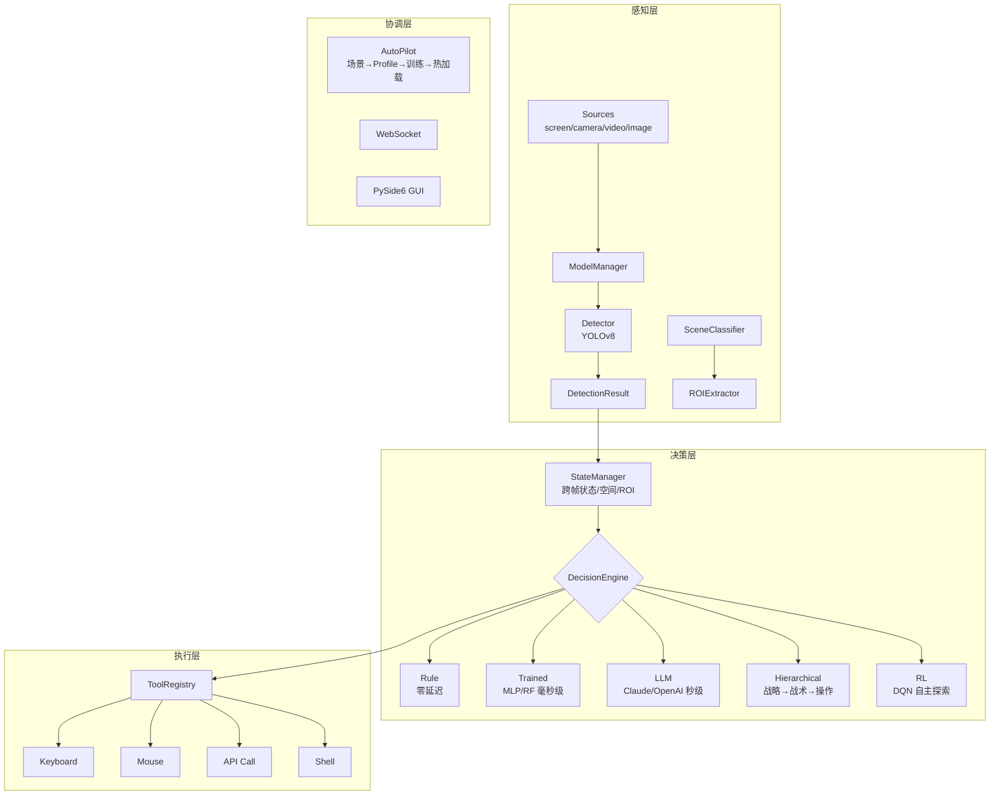

# Vision Agent

[](https://python.org)
[](LICENSE)
[](https://pytorch.org)
[](https://doc.qt.io/qtforpython/)

**Real-time visual perception + AI decision-making + automated action execution framework.**

一个基于计算机视觉的智能自动化框架。通过 YOLO 实时识别画面中的目标，结合 AI 决策引擎自动做出反应并执行操作（按键、鼠标、API 调用等）。

> **核心思路**：看到什么 → 判断该做什么 → 自动去做。整个过程可以从零开始自动学习，不需要手写规则。

---

## 能做什么

| 场景 | 说明 |
|------|------|
| **游戏 AI** | 识别游戏画面中的角色/敌人/技能，自动决策攻击、释放技能、撤退。内置王者荣耀、FPS 场景模板 |
| **桌面自动化** | 识别屏幕上的 UI 元素（按钮、输入框、图标），自动点击、输入、执行快捷键 |
| **视频/图像分析** | 对视频流或图片进行实时目标检测，统计目标数量、跟踪位置，通过 WebSocket 推送结果 |
| **自动学习闭环** | 录视频 → LLM 自动标注 → 训练决策模型 → 实时运行，全程无需手写规则 |

---

## 架构



```
感知层:  Sources(screen/camera/video/image) → ModelManager → Detector → DetectionResult
         SceneClassifier(场景识别) → ROIExtractor(区域特征)
决策层:  StateManager(跨帧状态/空间/ROI) → DecisionEngine → Action
         ├─ Rule     (规则引擎，零延迟)
         ├─ Trained  (MLP/RF，毫秒级)
         ├─ LLM      (Claude/OpenAI/本地，秒级)
         ├─ Hierarchical (分层：战略→战术→操作)
         └─ RL       (DQN 强化学习，自主探索)
执行层:  ToolRegistry → Tools(keyboard/mouse/api_call/shell) → ActionAgent
协调层:  AutoPilot(场景识别→Profile路由→自动训练→热加载)
         Pipeline 串联 + WebSocket + PySide6 GUI
```

---

## 功能列表

### 感知与检测

| 功能 | 说明 |
|------|------|
| **YOLO 实时检测** | 支持 YOLOv8 全系列模型（n/s/m/l），自动选择 GPU/CPU |
| **多输入源** | 屏幕捕获、摄像头、视频文件、图片目录、RTSP 流 |
| **ROI 提取** | 从固定区域提取特征（血条比例、颜色、亮度），辅助决策 |
| **帧率控制** | 可配置目标 FPS，防止 CPU/GPU 过载（`pipeline.target_fps`） |

### 决策引擎

| 功能 | 说明 |
|------|------|
| **规则引擎** | 基于 if-else 规则的决策，零延迟响应 |
| **LLM 决策** | 接入 Claude / OpenAI / Qwen / DeepSeek / Ollama |
| **训练模型决策** | MLP 或 RandomForest 轻量模型，毫秒级响应 |
| **分层决策** | 战略层（5s）→ 战术层（1s）→ 操作层（每帧），各层独立引擎 |
| **强化学习** | DQN 引擎，自主探索 + 经验回放 |

### 数据与训练

| 功能 | 说明 |
|------|------|
| **人工录制** | 录制键盘/鼠标 + 检测结果，生成训练数据 |
| **LLM 自动标注** | 视频抽帧 → YOLO 检测 → LLM 判断动作 → JSONL（支持 Tool Calling） |
| **多视频批量标注** | 选择多个视频一次性标注，自动生成独立输出文件 |
| **标注可视化回放** | 逐帧回放检测框 + LLM 决策动作/理由，含动作分布统计 |
| **标注纠错** | 可视化回放中直接修改动作、删除坏样本，保存修正后的 JSONL |
| **标注 A/B 对比** | 加载两份标注文件，逐帧对比决策差异，统计一致率 |
| **训练曲线可视化** | 实时显示 Loss / Train Acc / Val Acc 曲线 |
| **数据集质量分析** | 训练前分析样本数量、动作分布均衡度，提示潜在问题 |
| **YOLO 训练** | GUI 内配置数据集和参数，一键训练自定义检测模型 |
| **GPU/CPU 自动切换** | 训练和推理自动检测 CUDA，有 GPU 用 GPU，否则回退 CPU |

### 自动化与集成

| 功能 | 说明 |
|------|------|
| **场景 Profile** | YAML 配置定义场景（动作、按键、ROI 区域），快速切换 |
| **AutoPilot** | 自动识别场景 → 匹配 Profile → LLM 标注 → 训练 → 热加载 |
| **动作执行** | 键盘模拟、鼠标模拟、HTTP API 调用、Shell 命令 |
| **WebSocket** | 实时推送检测结果和决策动作 JSON，供外部系统对接 |
| **配置导入/导出** | 一键导出/导入配置和 Profiles 为 ZIP 压缩包 |
| **GUI 界面** | 深色科技感主题，配置/预览/录制/训练/标注/场景管理一体化 |
| **EXE 打包** | 一键打包为独立可执行文件，无需 Python 环境 |

---

## 快速开始

### 方式一：EXE 直接运行（推荐）

从 [Releases](../../releases) 下载最新版压缩包，解压后双击 `VisionAgent.exe` 即可，无需安装 Python。

### 方式二：源码运行

```bash
# 安装依赖
pip install -r requirements.txt

# GPU 支持（可选，推荐 NVIDIA 显卡用户安装）
pip install torch torchvision --index-url https://download.pytorch.org/whl/cu121

# GUI 模式
python gui_app.py

# CLI 模式
python main.py
python main.py --source screen --model yolov8n.pt
python main.py --no-gui

# Windows 快速启动（自动创建 venv）
start.bat
```

### 方式三：自行打包 EXE

```bash
# 一键打包（自动创建 venv + 安装依赖 + PyInstaller 打包）
build.bat

# 或手动打包
python -m venv .venv
.venv\Scripts\activate
pip install -r requirements.txt
pip install pyinstaller
python build_exe.py

# 产出在 dist/VisionAgent/ 目录下
dist\VisionAgent\VisionAgent.exe
```

> 打包使用 CPU 版 PyTorch，体积约 **886 MB**，运行内存约 **400 MB**。不需要目标机器安装 Python，将 `dist/VisionAgent/` 整个目录打包分发即可。

---

## 使用场景

### 场景一：游戏自动操作

1. 打开 GUI → 输入源选「屏幕捕获」
2. 场景 Tab 选择「王者荣耀 5v5」Profile
3. 检测模型选择训练好的模型（或用预训练的 yolov8n.pt 先体验）
4. 决策引擎选 `rule`（规则）或 `trained`（训练模型）
5. 点击「启动检测」，程序自动识别画面并操作

### 场景二：从零开始训练

1. 准备一段游戏视频
2. GUI →「录制/训练」Tab → 点击「LLM 自动标注」
3. 配置视频路径、YOLO 模型、LLM（如 Claude）
4. LLM 会逐帧分析画面并标注「这一帧应该做什么」
5. 点击「查看标注」，可视化回放检测框 + LLM 决策，支持纠错
6. 确认标注质量后点击「开始训练」，实时查看训练曲线
7. 切换决策引擎到 `trained`，配置动作→按键映射
8. 启动检测，模型自动决策

### 场景三：全自动 AutoPilot

1. 在 `profiles/` 下创建场景 YAML 配置
2. GUI → 场景 Tab → 勾选「启用 AutoPilot」
3. 启动检测，系统自动完成：场景识别 → Profile 匹配 → LLM 标注 → 模型训练 → 热加载部署

---

## 数据管线

### 方式一：人工录制

```bash
# 录制人工操作（键盘/鼠标 + YOLO 检测结果）
python main.py --record --record-dir data/recordings

# 训练决策模型
python scripts/train_decision.py --data data/recordings/*.jsonl --output runs/decision/exp1

# 使用训练模型
python main.py --decision trained --decision-model runs/decision/exp1
```

### 方式二：LLM 自动标注

```
准备视频 → LLM 自动标注 → 可视化回放审核 → 纠错/A/B对比 → 训练模型 → 部署
```

1. GUI「录制与训练」Tab → 点击「LLM 自动标注」（支持批量多视频）
2. 标注完成后点击「查看标注」，逐帧回放检测框 + 决策动作/理由
3. 可在回放中直接纠错、删除坏样本，或加载另一份标注做 A/B 对比
4. 确认标注质量后点击「开始训练」，实时查看 Loss/Acc 曲线
5. 切换决策引擎到 `trained`，配置动作映射

#### LLM 标注输出规范化

| 模式 | 说明 | 适用场景 |
|------|------|----------|
| **Tool Calling**（默认） | 函数调用 + `enum` 约束，LLM 被强制从预设动作列表中选择 | Claude、GPT-4o、Qwen 等支持 function calling 的模型 |
| **文本解析**（回退） | 从自由文本中提取 JSON 或关键词匹配 | Ollama 本地模型等不支持 tool calling 的场景 |

Tool Calling 模式下 LLM 收到的工具定义：
```json
{
  "name": "decide_action",
  "input_schema": {
    "properties": {
      "action": { "type": "string", "enum": ["attack", "retreat", "skill_1", "idle"] },
      "reason": { "type": "string" }
    },
    "required": ["action"]
  }
}
```

---

## 场景 Profile

Profile 是预定义的场景配置，存放在 `profiles/` 目录下：

```yaml
name: wzry_5v5
display_name: 王者荣耀 5v5
yolo_model: runs/detect/wzry/weights/best.pt
actions: [attack, retreat, skill_1, skill_2, skill_3, ultimate, recall, idle]
action_key_map:
  attack: {type: key, key: a}
  skill_1: {type: key, key: "1"}
roi_regions:
  hp_bar: [0.42, 0.92, 0.58, 0.95]
  minimap: [0.0, 0.7, 0.2, 1.0]
scene_keywords: [hero, tower, minion, monster]
auto_train:
  enabled: true
  sample_count: 500
  llm_provider: claude
```

内置模板：

| 模板 | 文件 | 说明 |
|------|------|------|
| 王者荣耀 5v5 | `wzry_5v5.yaml` | 8 动作，含血条/小地图/技能栏 ROI |
| 通用 FPS 射击 | `fps_generic.yaml` | 12 动作，含准心/血量/弹药 ROI |
| 桌面通用 | `desktop.yaml` | 8 动作，使用预训练 yolov8n.pt |

---

## 配置

编辑 `config.yaml` 自定义：
- 视频源类型和参数
- YOLO 模型和检测参数（置信度、NMS、推理分辨率）
- 决策引擎（rule / llm / trained / hierarchical / rl）
- 动作映射（语义动作名 → 实际按键/鼠标/API）
- 管线帧率（`pipeline.target_fps`）
- WebSocket 服务端口

---

## 项目结构

```
vision-agent/
├── main.py                          # CLI 入口
├── gui_app.py                       # PySide6 GUI 入口
├── build.bat / build_exe.py         # EXE 打包
├── config.yaml                      # 全局配置
├── profiles/                        # 场景 Profile 配置
│   ├── wzry_5v5.yaml
│   ├── fps_generic.yaml
│   └── desktop.yaml
├── scripts/
│   └── train_decision.py            # 决策模型训练 CLI
├── examples/
│   ├── run_demo.py
│   └── wzry_demo.py
├── vision_agent/
│   ├── core/                        # 检测、状态、场景分类、ROI、管线
│   ├── decision/                    # Rule / LLM / Trained / Hierarchical / RL
│   ├── profiles/                    # 场景 Profile 管理
│   ├── auto/                        # AutoPilot + AutoTrainer
│   ├── data/                        # 数据录制、LLM 标注、训练
│   ├── tools/                       # 键盘/鼠标/API/Shell
│   ├── agents/                      # ActionAgent
│   ├── sources/                     # 视频源 (screen/camera/video/image)
│   ├── server/                      # WebSocket 服务
│   └── gui/                         # PySide6 GUI（含标注可视化、训练图表）
├── tests/
│   └── test_auto_annotator.py
└── requirements.txt
```

---

## WebSocket API

连接 `ws://localhost:8765` 接收实时数据。

**检测结果：**
```json
{
  "type": "detection",
  "frame_id": 42,
  "timestamp": 1710000000.123,
  "inference_ms": 12.5,
  "frame_size": [1920, 1080],
  "count": 2,
  "detections": [
    {
      "class_id": 0,
      "class_name": "person",
      "confidence": 0.92,
      "bbox": [100.0, 200.0, 300.0, 500.0],
      "bbox_norm": [0.0521, 0.1852, 0.1563, 0.4630]
    }
  ]
}
```

**决策动作：**
```json
{
  "type": "decision",
  "actions": [
    {
      "tool": "keyboard",
      "parameters": {"key": "a"},
      "reason": "发现敌方英雄，执行攻击",
      "priority": 1
    }
  ]
}
```

---

## 技术栈

| 组件 | 技术 |
|------|------|
| 目标检测 | YOLOv8 (ultralytics) |
| 图像处理 | OpenCV |
| 深度学习 | PyTorch（自动 GPU/CPU） |
| 机器学习 | scikit-learn |
| GUI | PySide6 (Qt) |
| LLM 接入 | Claude / OpenAI / Qwen / DeepSeek / Ollama |
| 输入模拟 | pynput |
| 屏幕捕获 | mss |
| 实时通信 | websockets |
| 打包分发 | PyInstaller |

---

## License

MIT
